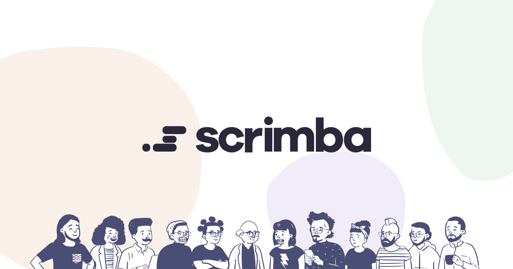

#### <a href="https://scrimba.com" target="_blank" alt="Scrimba's website">SCRIMBA | MODULE 4 | OLDAGRAM</a> 

This is a solo project by <a href="https://scrimba.com/learn/frontend" target="_blank" alt="Scrimba's frontend career path web page">Scrimba's Frontend Career Path</a>

#### <a href="" target="_blank">view the live version here</a>



<br>

#### ABOUT
## What is the project all about?

Oldagram is a creative twist on the renowned Instagram application, envisioning what Instagram might have been like if it had existed in the 1800s.

We were given a figma <a href="https://www.figma.com/file/h0MKma9TTWzGOMQ9Ia6ROW/Oldagram?node-id=0%3A1" target="_blank" alt="Link to the Figma design file">file</a> from which to design off of and given requirements & stretch goals to can complete the project, list can be seen [here](#project-goals--stretch-goals).

As all my projects with Scrimba, I like to showcase the project if possible within a larger site. What you will find is a hero section, a project section where the figma design will be laid out on display and a footer to share credits to those who's images were used. You should also find that information [here](#sources-used-within-this-project).

<br>

#### PROJECT SCREENS
## How the project looks

 

<br>

#### REQUIREMENTS
## This is what will be required to run this project

- Knowledge on HTML, CSS & JavaScript
- Editor | _recommendation: <a href="https://code.visualstudio.com/" target="_blank" src="Visual Studio Code Website">Visual Studio Code</a>_

<br>

#### TREE & BLOBS
## Repository file & directory layout

- [assets/](./assets/)
    - [css/](./assets/css/)
        - [styles.css](./assets/css/styles.css)
    - [images/](./assets/images/)
      - [favicon/](./assets/images/favicon/)
      - [hero/](./assets/images/hero/)
      - [project-images/](./assets/images/project-images/)
      - [readme/](./assets/images/readme/)
    - [javascript/](./assets/javascript/)
        - [app.js](./assets/javascript/app.js)
        - [posts.js](./assets/javascript/posts.js)
- [index.html](./index.html)
- [README.md](./README.md)
- [site.webmanifest](./site.webmanifest)

<br>

#### PROJECT GOALS & STRETCH GOALS
## What needs to be done for the project

##### REQUIRED

- Create the first post
- Use semantic HTML
- Add hover effects to the icons

<br>

##### STRETCH GOALS

- Use JavaScript to render out all 3 posts
- Increase the likes of the post when a user clicks the heart icon

<br>

#### DESIGN NOTES
## Figma file, Colors, Fonts & basic file setup pertaining to this project

- Figma file can be found <a href="https://www.figma.com/file/h0MKma9TTWzGOMQ9Ia6ROW/Oldagram?node-id=0%3A1" target="_blank" alt="Link to the Figma design file">here</a>
- Font used within project
  - ```html
        <!-- Nothing here -->
    ```

  - ```css
        /* Google Font */
        @import url('https://fonts.googleapis.com/css2?family=Inter:wght@400;500;700&family=Source+Sans+3:wght@400;500;700&display=swap');
    ```

- Color palette used within project
  - ```css
        /* color setup */
        --clr-shadow: hsl(195, 18%, 30%);
        --clr-background-shade: hsl(195, 53%, 39%);
        --clr-background-main: hsl(195, 53%, 59%);
        --clr-background-tint: hsl(195, 53%, 79%);
        --clr-headline: hsl(195, 34%, 30%);
        --clr-paragraph: hsl(195, 44%, 40%);
        --clr-stroke: hsl(195, 12%, 88%);
        --clr-accent: hsl(195, 71%, 56%);
        --clr-accent-tint: hsl(160, 71%, 66%);
        --clr-button: hsl(195, 14%, 80%);
        --clr-button-text: var(--clr-shadow);
        --clr-button-before: linear-gradient(140deg,
            hsl(0, 0%, 95%),
            hsl(0, 0%, 65%));
        --clr-button-plus: var(--clr-accent-tint);
        --clr-button-plus-text: var(--clr-shadow);
        --clr-button-plus-before: linear-gradient(140deg,
            var(--clr-accent-tint),
            var(--clr-accent));
        --clr-button-shadow: var(--clr-shadow);
    ```

  - ```javascript
      // Light & Dark Theme not implemented on this project
    ```

- General project variables layout
  - ```css
    :root {
      /* Document setup */
      /* typeface */
      --typeface-inter: 'Inter', sans-serif;
      --typeface-ssp: 'Source Sans 3', sans-serif;

      /* percentage fonts */
      --percentage-font-10: 62.5%;
      --percentage-font-9: 56.25%;
      --percentage-font-8: 50%;
      --percentage-font-7: 43.75%;

      /* font size */
      --font-10: 1rem;
      --font-12: 1.2rem;
      --font-14: 1.4rem;
      --font-16: 1.6rem;
      --font-18: 1.8rem;
      --font-20: 2rem;
      --font-24: 2.4rem;
      --font-30: 3rem;
      --font-32: 3.2rem;
      --font-36: 3.6rem;
      --font-44: 4.4rem;
      --font-52: 5.2rem;
      --font-62: 6.2rem;
      --font-74: 7.4rem;
      --font-86: 8.6rem;
      --font-98: 9.8rem;

      /* font weight */
      --font-weight-400: 400;
      --font-weight-500: 500;
      --font-weight-700: 700;

      /* spacing system */
      --spacing-2: 0.2rem;
      --spacing-4: 0.4rem;
      --spacing-8: 0.8rem;
      --spacing-12: 1.2rem;
      --spacing-16: 1.6rem;
      --spacing-24: 2.4rem;
      --spacing-32: 3.2rem;
      --spacing-48: 4.8rem;
      --spacing-64: 6.4rem;
      --spacing-80: 8rem;
      --spacing-96: 9.6rem;
      --spacing-128: 12.8rem;

      /* border radius */
      --border-rad-05: 0.5rem;
      --border-rad-1: 1rem;
      --border-rad-100: 10rem;
      --border-rad-round: 50%;

      /* line height */
      --line-height-1: 1;
      --line-height-11: 1.1;
      --line-height-15: 1.5;
      --line-height-17: 1.7;

      /* letter spacing */
      --letter-space-n05: -0.5px;
      --letter-space-n1: -1px;
      --letter-space-p05: 0.5px;
      --letter-space-p1: 1px;
    }
    ```

- **Done By** styling
  - ```css
      /* ( Just to keep each project consistent ) */
      .done-by {
        font-size: var(--font-12);
        line-height: var(--line-height-15);
        letter-spacing: var(--letter-space-n05);
      }
      
      .done-by--link,
      .done-by--link:link,
      .done-by--link:visited {
        display: inline-block;
        font-size: var(--font-14);
        font-weight: var(--font-weight-500);
        text-decoration: none;
        color: var(--clr-paragraph);
      }
      
      .done-by--link:hover,
      .done-by--link:active {
        border-bottom: 1px solid var(--clr-paragraph);
      }
    ```

<br>

#### SOURCES
## Sources used within this project

- Scrimba Bootcamp
  - <a href="https://scrimba.com/bootcamp " target="_blank" alt="link to scrimba bootcamp">scrimba.com/bootcamp</a>
- Images used within the project, credit goes to catalyststuff
  - <a href="https://www.freepik.com/free-vector/boy-playing-basketball-cartoon-people-sport-icon-concept-isolated-flat-cartoon-style_10920751.htm#query=basketball&position=0&from_view=author" target="_blank" alt="Link to catalyststuff profile on Freepik">Images by catalyststuff on Freepik</a>
- Image resizing for better optimization
  - <a href="https://squoosh.app/" target="_blank" alt="A link to a website named Squoosh that helps for image file types and compression for better site optimization">squoosh.app</a>

<br>

#### CREDITS
## Those who worked on the project can be found below

- <a href="https://github.com/awcoetzer" target="_blank">Andre W. Coetzer</a>